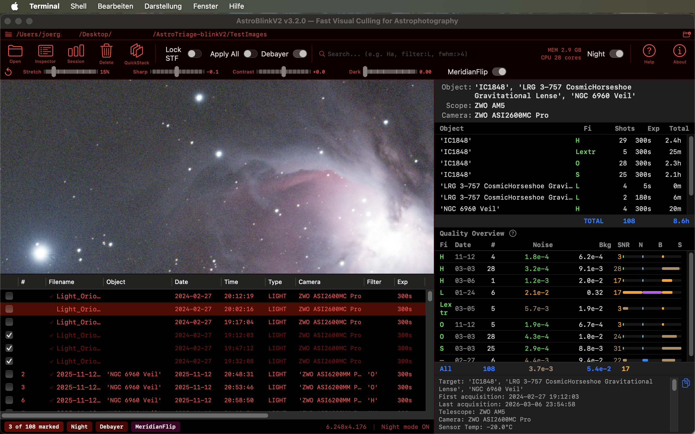

# AstroBlinkV2

**Fast visual culling for astrophotography sessions on macOS.**

Blink, mark, stack - triage your astro XISF, FITS subs in seconds. GPU-stretched viewer with QuickStack,QuickLook, and fastest keyboard post processing workflow on macOS.

AstroBlinkV2 lets you blink through hundreds of FITS and XISF sub-exposures in seconds, mark the bad ones, and move them out of the way — without ever permanently deleting a single file. Inspired by PixInsight's Blink, built from the ground up for Apple Silicon. 

Nice side effect: Finally you have a native XISF and FITS Quicklook for macOS. (press Spacebar shows a quick preview of the image). Was missing that for long ! :-) 

  

---



---

## What's New in v3.3.0

### LightspeedStacker — blazing fast GPU stacking
- **GPU warp+accumulate kernel** — bilinear interpolation warping runs entirely on the GPU (10-20x faster than CPU)
- **Parallel star detection** — all frames analyzed simultaneously via Swift TaskGroup
- **Hash-based triangle matching** — O(1) candidate lookup instead of O(N²) brute-force comparison
- **Reduced overhead** — fewer stars (30 vs 50) and triangles (120 vs 455) for preview-quality matching
- **vDSP vectorized normalization** — final pixel averaging uses Accelerate framework
- **Smarter previews** — mini preview updates every 3rd frame instead of every frame

### Two stackers — pick your speed
- **LightspeedStacker** (bolt icon) — GPU-optimized, fast, great for quick visual previews
- **NormalStacker** (turtle icon) — uses more stars and triangles, potentially better on fields with few bright stars

### Benchmark Stats
- **Window > Benchmark Stats** — see exactly how long each loading phase takes (file scanning, first image, header reading, pre-caching, stacking)
- **Memory monitor** — live app RAM usage with system total and swap

### Other improvements
- **Photoshop-style zoom** in stacked result window (click-drag horizontal = zoom, scroll = pan, pinch, double-click reset)
- **Friendly alerts** — clicking a stacker without selecting images shows a helpful dialog with tips
- **Aligned toolbar** — all icons sit on the same baseline with two-line labels

---

## What's New in v3.2.0

### Quick Stack — GPU-accelerated live stacking
- **Quick Stack** — select 3+ subs and stack them instantly with star-alignment (no plate solving needed)
- **Triangle pattern matching** — scale-invariant star matching with affine alignment
- **GPU bin2x** — halves resolution before stacking for ~4x speed improvement
- **Blue star crosses** — live visualization of detected stars during processing
- **Full result window** — zoomable stacked result with all 4 sliders (stretch, sharp, contrast, dark)
- **Save as PNG** — exports with current adjustments, smart filename from session metadata
- **Same-target validation** — prevents accidental stacking of different objects (checks name + RA/DEC)

### Slider improvements
- **Doubled slider ranges** — Stretch 0–100%, Sharp -4/+4, Contrast -2/+2, Dark 0–1.0
- **vDSP-optimized rendering** — Quick Stack result slider adjustments ~5-10x faster

### Quality Overview
- **Interactive help** — click the ? icon for a comprehensive beginner-friendly guide with real-world examples
- **More space** — expanded quality section, compact fact sheet area
- **Brown replaces yellow** — better readability for medium noise/SNR values

### Other improvements
- **Zoom keys keep focus** — +/- no longer loses keyboard focus on file list
- **Inspector scroll preserved** — header inspector scroll position persists across image navigation

---

## What's New in v3.0.0

- **Spotlight-style search** — real-time filtering with `column:value` syntax (e.g. `filter:Ha`, `fwhm:>4`, `file:Veil`)
- **Cmd+M — Move to folder** — move checkmarked files to any destination folder (with "Create New Folder" support)
- **Full undo for all moves** — Cmd+Z undoes both PRE-DELETE and Cmd+M operations
- **H cycles 3 view states** — all files → hide marked → show only marked → all
- **Lock STF + Apply All** — freeze stretch params or bake settings into all cached previews
- **GPU post-processing** — real-time sharpening, contrast, and dark level sliders (Metal compute)
- **OSC debayer fix** — proper mono/color toggle with correct stretch for both modes
- **Persistent settings** — sliders, toggles, column order remembered across sessions
- **19 default-visible columns** — Date, Time, Type, Camera now shown by default
- **Mark/Unmark filtered** — batch checkmark all search results for quick triage

---

## Performance

**Up to 5x faster session loading on local SSD. Up to 8x faster on network volumes (NAS/10GbE).**

AstroBlinkV2 was rewritten for full hardware utilization on Apple Silicon. On a Mac Studio M3 Ultra with 300 FITS files (~100 MB each), total session load time dropped from minutes to under 45 seconds.

| What changed | Before | After | Gain |
|---|---|---|---|
| FITS decode | 1 file at a time | Up to 6 concurrent | **4x throughput** |
| Memory per decode | 116 MB copy | Zero-copy GPU buffer | **-116 MB/image** |
| Downsampling (50 MP) | 30–150 ms (CPU) | < 1 ms (GPU) | **100x faster** |
| Header reading (300 files) | ~9 s | ~1.5 s | **6x faster** |
| STF statistics | ~50 ms | ~17 ms | **3x faster** |
| Prefetch pattern | Batch 4, wait all | Sliding window | **50% less stall** |
| NAS file transfer | Single stream | 4 parallel streams | **3–4x faster** |

**End-to-end (300 files, local SSD):**

| Phase | v0.9.7 | v2.0.0+ |
|---|---|---|
| Header reading | ~9 s | ~1.5 s |
| First image display | ~250 ms | ~170 ms |
| Full session prefetch | Minutes | ~30–45 s |
| Navigation (warm cache) | < 32 ms | < 32 ms |

---

## Why AstroBlinkV2?

After a night of imaging you might have 200-600 sub-exposures. Some have clouds, tracking errors, satellite trails, or planes. You need to find and remove them before stacking. AstroBlinkV2 makes this fast:

1. **Open your session folder** (Cmd+O) — images load instantly with metadata parsed from filenames and headers
2. **Blink through frames** — arrow keys with key repeat let you scan frames like a flip-book
3. **Mark the bad ones** — hit Space on anything that looks wrong (clouds, trails, blur)
4. **Hide and skip** — press H to hide marked frames from the list, K to skip them during navigation
5. **Pre-delete** — Cmd+Backspace moves all marked files to a `PRE-DELETE` subfolder — nothing is ever permanently deleted
6. **Undo if needed** — full undo stack lets you restore any pre-delete operation (Cmd+Z)
7. **Review your session** — Session Overview shows per-filter integration times and generates a shareable Fact Sheet
8. **Stack** — select your best subs and hit LightspeedStacker or NormalStacker for an instant stacked preview

---

## Complete Feature List

### Image Viewing & Rendering
- Metal GPU rendering — 50-megapixel images display in milliseconds on Apple Silicon
- Auto STF stretch — PixInsight-compatible Screen Transfer Function makes raw linear data visible
- Lock STF (S key) — freeze exact c0/mb stretch params from current image for brightness comparison
- Apply All — bake current stretch + post-processing into all cached previews for instant navigation
- Adjustable stretch strength — slider from 0% (linear) to 100% (maximum stretch)
- GPU post-processing — real-time sharpening (unsharp mask), contrast (S-curve), and dark level sliders
- Doubled slider ranges — Stretch 0–100%, Sharpening -4/+4, Contrast -2/+2, Dark Level 0–1.0
- Zoom & pan — click-drag zoom (Photoshop-style), trackpad pinch, +/- keys, scroll to pan
- Double-click to reset zoom to fit-to-view
- Persistent settings — all sliders, toggles, and column layout remembered across sessions

### Stacking — Two Modes
- **LightspeedStacker** — GPU warp kernel, hash-based triangle matching, parallel star detection. Blazing fast.
- **NormalStacker** — CPU warp, brute-force triangle matching, more stars. Slower but potentially more accurate on sparse fields.
- Both: select 3+ images and stack with one click — no plate solving required
- Triangle pattern matching for scale-invariant star alignment
- Affine transform alignment (rotation + translation + scale)
- GPU bin2x pre-processing for ~4x faster stacking
- Live blue star crosses showing detected stars during processing
- Full result window with Photoshop-style zoom and all 4 adjustment sliders
- Save as PNG with smart filename (object_date_filters_camera.png)
- Same-target validation — warns if you accidentally select images of different objects
- vDSP-accelerated rendering for fast slider response in result window

### OSC Debayer
- Automatic Bayer pattern detection (RGGB, GRBG, GBRG, BGGR) from FITS/XISF headers
- Toggle on/off (D key) — debayer OFF (default) for fastest caching, ON for color preview
- GPU-accelerated bilinear interpolation Metal compute kernel
- Debayer indicator only visible when session contains OSC images

### Night Mode
- Red-on-black UI — preserves dark-adapted vision at the telescope
- Press N — toggle night mode on/off, affects all UI elements including file list, status bar, and overlays

### Search & Filter
- Spotlight-style search — real-time filtering in the toolbar, reduces file list as you type
- Plain text search — searches across all columns (filename, object, filter, camera, etc.)
- Column syntax — `filter:Ha`, `file:Veil`, `type:LIGHT`, `fwhm:>4`, `stars:<500`, `exp:300`
- Column aliases — short forms like `fil`, `obj`, `cam` work as column prefixes
- Numeric operators — `>`, `<`, `>=`, `<=`, `=` for FWHM, HFR, stars, exp, gain, etc.
- Mark/Unmark filtered — batch checkmark all search results, then move or delete

### Blink Workflow & File Operations
- Space — mark/unmark images for pre-deletion (single or multi-select)
- K — skip over already-marked images during navigation
- H — cycle view: all files → hide marked → show only marked → all
- Cmd+Backspace — move all marked files to a `PRE-DELETE` subfolder (never permanent deletion)
- Cmd+M — move checkmarked files to any folder (with "Create New Folder" dialog)
- Full undo stack — Cmd+Z undoes both PRE-DELETE and Cmd+M moves, unlimited depth
- Multi-select — Shift/Cmd+click in the file list, then Space to mark all selected at once
- Arrow keys stop at boundaries (no wrap-around)
- Page Up/Home and Page Down/End for jump to first/last image

### Computed Star Metrics (HFR & FWHM)
- **GPU-accelerated star detection** — during session loading, every frame is analyzed for stars using a Metal compute kernel on the GPU (~3-5ms per image)
- **HFR & FWHM measurement** — Half-Flux Radius and Full Width at Half Maximum are computed via Gaussian fitting for the brightest unsaturated stars in each frame
- **Automatic quality scoring** — computed metrics feed into the quality estimator for z-score based frame ranking (good/uncertain/trash)
- **Works without NINA** — even if your capture software doesn't provide HFR/FWHM, AstroBlinkV2 computes them from the actual image data
- **Per-group source consistency** — when mixing images with and without capture-software HFR, quality scoring uses a single consistent measurement method per group to ensure fair comparison

### Metadata & Session Overview
- NINA filename parsing — automatically extracts target, filter, exposure, gain, temperature, HFR, star count, and more
- FITS/XISF header reading — pulls metadata directly from file headers (filter, exposure, camera, telescope, mount, coordinates, pier side, etc.)
- Header Inspector (I key) — floating window with all FITS/XISF keywords, search filtering, highlighted important keywords, scroll position preserved, multi-row selection with Cmd+C copy and "Copy All" button
- Session Overview — per-object/filter/exposure breakdown with total integration time
- Quality Overview — per-filter noise, background, and SNR statistics with color-coded bars
- Interactive quality help — click ? for beginner-friendly explanation with real-world examples and rules of thumb
- Fact Sheet generator — one click copies a ready-to-paste summary with hashtags for Astrobin, Instagram, or forums
- Auto Meridian Flip — automatically rotates images across pier side changes for consistent orientation. Supports both PIERSIDE header and ROTATOR angle fallback (for mounts like ASIAIR on AM5 that don't write PIERSIDE)
- Astronomical observing night — sessions spanning midnight are treated as one night. Quality scoring and grouping use the evening date, not the calendar date

### File List & Sorting
- 20+ sortable columns — click any column header to sort, drag to reorder
- Columns include: #, Filter, Q (quality), SNR, FWHM, HFR, Night (observing night), Time, Object, Filename, Type, Camera, Exposure, Temps, Gain, Size, Stars, Subfolder, and more
- Quality tooltips — hover over Q column for score explanations or why a score is missing
- Right-click context menu — copy filename, file path, or full path
- Smart folder scanning — opens root images only when present, scans subfolders when root is empty
- Individual file selection — select specific files instead of entire folders
- File size column with human-readable formatting (MB/GB)

### Format Support

| Format | Compression | Library |
|--------|-------------|---------|
| XISF | Uncompressed, LZ4, LZ4HC, zlib, zstd, ByteShuffle | libxisf |
| FITS | Uncompressed, fpack (Rice, GZIP) | cfitsio |

### Network Volumes
- Images from NAS/SMB shares are automatically cached locally for fast browsing
- Stop/continue caching at any time with inline controls
- 4 parallel network streams for maximum throughput
- Cache is cleaned up automatically on quit

### QuickLook Extensions
- Thumbnail provider — FITS/XISF thumbnails in Finder
- Preview provider — full-size FITS/XISF preview in QuickLook (press Space in Finder)

---

## Screenshots

### macOS — AstroBlinkV2

**Session Overview with Header Inspector:**


**Image Viewer with Session Overview:**


**Night Mode — red-on-black for dark-adapted vision:**


### iOS — AstroFileViewer

| M42 Orion (OSC color, debayered) | NGC 6960 Veil (mono) | FITS/XISF Headers |
|:---:|:---:|:---:|
|  |  |  |

**iPad — M42 Orion Nebula with Stretch & Debayer controls:**


---

## Keyboard Shortcuts

| Key | Action |
|-----|--------|
| `←` `→` | Previous / next image |
| `Page Up/Home` | Jump to first image |
| `Page Down/End` | Jump to last image |
| `+` `-` | Zoom in / out |
| `Space` | Toggle pre-delete mark (single or multi-select) |
| `Cmd+Backspace` | Move marked files to PRE-DELETE folder |
| `Cmd+M` | Move marked files to a chosen folder |
| `Cmd+Z` | Undo last move operation |
| `S` | Toggle Lock STF (freeze stretch params) |
| `K` | Toggle skip-marked during navigation |
| `H` | Cycle view: all → hide marked → only marked → all |
| `I` | Toggle FITS/XISF header inspector |
| `D` | Toggle OSC debayer (when Bayer images detected) |
| `N` | Toggle night mode (red-on-black) |
| `Cmd+O` | Open folder or select files |
| `Double-click` | Reset zoom to fit-to-view |

---

## AstroFileViewer — iOS Companion App

**AstroFileViewer** is a companion iOS/iPadOS app for viewing FITS and XISF astrophotography files on your iPhone or iPad.

<!-- TODO: Add App Store badge/link when available -->
<!-- [](https://apps.apple.com/app/astrofileviewer/idXXXXXXXXXX) -->

### Features

- **Open FITS and XISF files** directly from the Files app, iCloud Drive, or any document provider
- **Auto STF stretch** — same PixInsight-compatible algorithm as the macOS app
- **Adjustable stretch strength** — slider from 0% (fully linear) to 100%
- **OSC debayer** — automatic Bayer pattern detection with GPU-accelerated bilinear interpolation
- **Sharpening** — real-time unsharp mask with adjustable strength
- **FITS/XISF header viewer** — browse all metadata keywords with priority sorting
- **Save to Photos** — export stretched images as JPEG to your Photo Library
- **Universal app** — optimized for both iPhone and iPad
- **Automatic bin2 display** — large sensor images (e.g. ZWO ASI6200MM at 9576×6388) are automatically downscaled for smooth display

### iOS Screenshots

| iPhone — M42 | iPhone — Veil | iPad — M42 |
|:---:|:---:|:---:|
|  |  |  |

The iOS app source code is included in this repository under [`AstroFileViewer-iOS/`](AstroFileViewer-iOS/).

---

## Requirements

### macOS (AstroBlinkV2)
- **macOS 13 Ventura** or later
- **Apple Silicon** recommended (M1/M2/M3/M4) — runs on Intel but optimized for unified memory architecture
- Metal-capable GPU (all Macs since 2012)

### iOS (AstroFileViewer)
- **iOS 16.4** or later
- iPhone or iPad with Metal support

---

## Installation

### Download Release (macOS)

1. Download the latest release from the [Releases](https://github.com/joergs-git/AstroBlinkV2/releases) page
2. Unzip and drag `AstroBlinkV2.app` to your **Applications** folder
3. Double-click to launch — the app is signed and notarized by Apple

### AstroFileViewer (iOS)

Download AstroFileViewer from the Apple App Store (link coming soon).

### Build from Source

1. Clone the repository:
   ```bash
   git clone https://github.com/joergs-git/AstroBlinkV2.git
   cd AstroBlinkV2
   ```

2. **macOS app:** Open `AstroTriage.xcodeproj` in Xcode 15+ and build (Cmd+R)

3. **iOS app:** Open `AstroFileViewer-iOS/AstroFileViewer.xcodeproj` in Xcode 15+ and build for your device

The project includes vendored C/C++ libraries (libxisf, cfitsio) as a local Swift Package — no external dependencies to install.

---

## How It Works

AstroBlinkV2 decodes FITS and XISF files using cfitsio and libxisf through a C bridge, renders them on the GPU via Metal compute shaders with a PixInsight-compatible STF auto-stretch, and displays them in an MTKView. Navigation is keyboard-first with full key repeat support. Metadata is extracted from both filenames (NINA token patterns) and file headers, merged with header values taking priority.

The workflow is non-destructive by design: marking a file only sets a flag in memory, and the "pre-delete" action physically moves files to a dedicated subfolder — never to Trash, never permanently deleted. A full undo stack allows you to reverse any pre-delete operation.

Both stackers use triangle pattern matching on the brightest stars in each frame, compute affine transforms for alignment, and mean-combine aligned frames — all without external plate solving. LightspeedStacker runs the warp+accumulate step on the GPU via a Metal compute kernel and uses hash-based triangle lookup for near-instant matching. NormalStacker uses CPU warping with more stars for potentially higher accuracy on sparse star fields.

Floating windows (Session Overview, Header Inspector, Quick Stack Result) stay above the main AstroBlinkV2 window while working but go behind other apps when you switch away.

---

## Supported NINA Filename Tokens

AstroBlinkV2 parses the standard NINA filename pattern:

```
2026-03-06_IC1848_23-54-58_RASA_ZWO ASI6200MM Pro_LIGHT_H_300.00s_#0016__bin1x1_gain100_O50_T-10.00c__FWHM_4.15_FOCT_4.46.xisf
```

Extracted tokens: date, target, time, telescope, camera, frame type, filter, exposure, frame number, binning, gain, offset, sensor temp, FWHM, focuser temp, HFR, star count.

---

## FAQ

### Why is LightspeedStacker so fast?

Six optimizations working together:

1. **GPU warp+accumulate** — The biggest bottleneck in stacking is warping each frame to match the reference. NormalStacker does this on the CPU: a nested loop over millions of pixels with bilinear interpolation. LightspeedStacker offloads this to a Metal compute kernel that runs thousands of GPU threads in parallel, achieving 10-20x speedup on the warp step alone.

2. **Parallel star detection** — NormalStacker detects stars one frame at a time. LightspeedStacker uses Swift's `TaskGroup` to analyze all frames simultaneously across multiple CPU cores.

3. **Hash-based triangle matching** — NormalStacker compares every triangle in each frame against every triangle in the reference (O(N²) comparisons). LightspeedStacker quantizes triangle shape ratios into hash buckets and only checks nearby buckets — turning an O(N²) search into O(1) lookups. With 120 triangles per frame, this eliminates ~99% of comparisons.

4. **Fewer stars, still accurate** — LightspeedStacker uses 30 stars and the 10 brightest for triangles (120 combinations) vs NormalStacker's 50 stars and 15 for triangles (455 combinations). For visual stacking, 30 bright stars provide plenty of matching accuracy.

5. **vDSP vectorized normalization** — The final pixel averaging uses Apple's Accelerate framework (vDSP) for SIMD-vectorized division across the entire image plane.

6. **Smarter mini previews** — During stacking, the live preview only updates every 3rd frame instead of every frame, reducing overhead.

### When should I use NormalStacker instead?

NormalStacker uses more stars (50 vs 30) and builds more triangles (455 vs 120), which can make a difference on:
- **Sparse star fields** — targets with very few bright stars (e.g. dark nebulae)
- **Heavily cropped frames** — where only a handful of stars are visible
- **Mixed focal length sessions** — where scale differences push stars to the edge of matching tolerance

If LightspeedStacker fails to align some frames, try NormalStacker on the same selection.

### Why don't the computed HFR/FWHM values match what NINA reports?

Different software measures HFR/FWHM differently. NINA measures during capture (often on a subframe), while AstroBlinkV2 measures post-capture on the full saved frame with its own star detection algorithm. The absolute numbers will differ, but the *relative ranking* (which frames are better/worse) should be very consistent. AstroBlinkV2's quality scoring always uses the same measurement method across all frames in a group to ensure fair comparison.

### Is the quality scoring scientifically accurate?

The quality scoring is designed for *triage* — quickly identifying the best and worst frames for stacking decisions. It uses robust statistical methods (median HFR, FWHM, noise estimation, z-scores within groups) but is not intended to replace scientific photometry tools like PixInsight or AstroImageJ. Think of it as a fast, automated version of the visual blinking you'd do in PixInsight's Blink tool, enhanced with quantitative metrics.

### Is this scientific stacking?

No. Both stackers are designed for **visual preview only** — a quick "what does my data look like stacked?" without leaving the triage app. They are not a replacement for dedicated stacking software like PixInsight, Siril, or APP. Specifically:

- **No astrometric calibration** — alignment uses triangle pattern matching, not plate solving with a star catalog
- **No sub-pixel interpolation** — warping uses bilinear interpolation, not Lanczos or drizzle
- **No outlier rejection** — hot pixels, satellite trails, airplanes, and cosmic rays are not removed
- **No calibration frames** — no dark, flat, or bias subtraction
- **Mean combine only** — no sigma clipping, winsorized sigma, or other robust rejection methods

The stacked result is meant to give you a quick visual impression of your session's potential — not a final image.

---

## Author

**joergsflow**

- [Astrobin Gallery](https://app.astrobin.com/u/joergsflow#gallery)
- [Instagram](https://www.instagram.com/joergsflow/)
- [GitHub](https://github.com/joergsflow)
- joergsflow@gmail.com

---

## License

This project is licensed under the **GNU General Public License v3.0** — see [LICENSE](LICENSE) for details.

libxisf is licensed under GPLv3. cfitsio is licensed under the NASA Open Source Agreement.

---

*Clear skies and happy imaging!*
