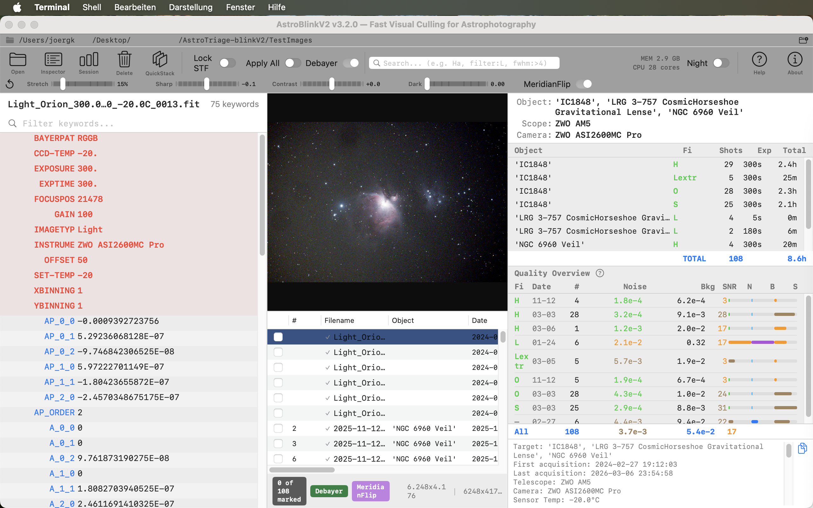
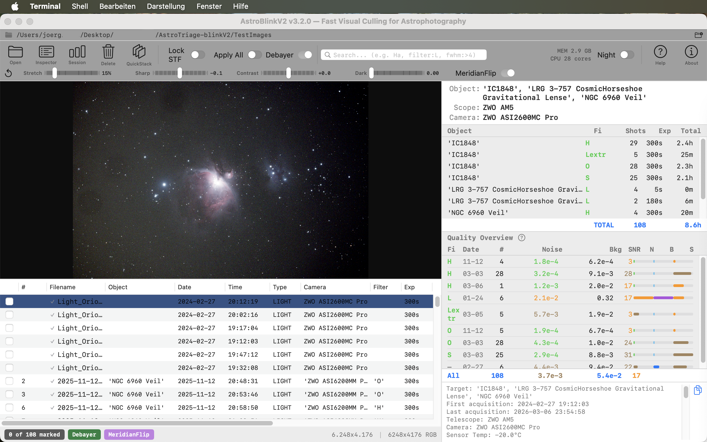
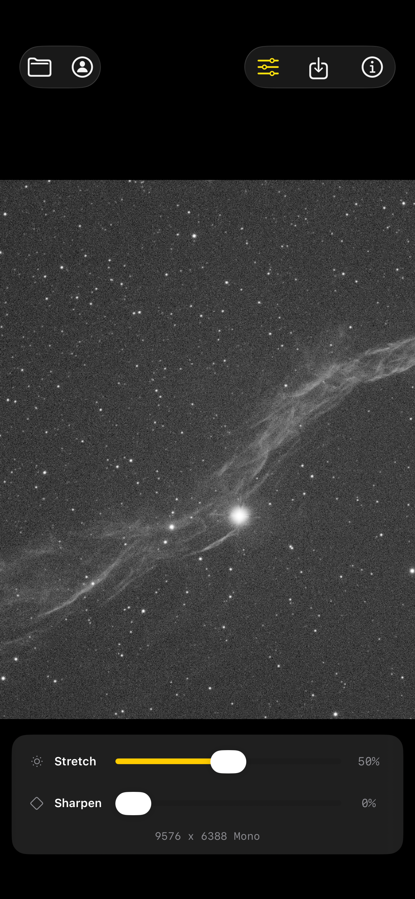
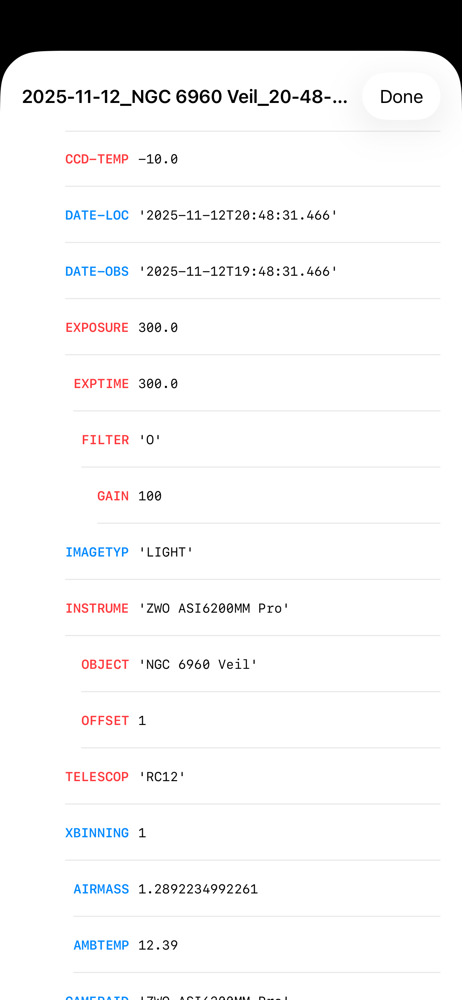

# AstroBlinkV2

**Fast visual culling for astrophotography sessions on macOS.**

AstroBlinkV2 lets you blink through hundreds of FITS and XISF sub-exposures in seconds, mark the bad ones, and move them out of the way — without ever permanently deleting a single file. Inspired by PixInsight's Blink, built from the ground up for Apple Silicon.

  

---



---

## Why AstroBlinkV2?

After a night of imaging you might have 200-600 sub-exposures. Some have clouds, tracking errors, satellite trails, or planes. You need to find and remove them before stacking. AstroBlinkV2 makes this fast:

1. **Open your session folder** (Cmd+O) — images load instantly with metadata parsed from filenames and headers
2. **Blink through frames** — arrow keys with key repeat let you scan frames like a flip-book
3. **Mark the bad ones** — hit Space on anything that looks wrong (clouds, trails, blur)
4. **Hide and skip** — press H to hide marked frames from the list, K to skip them during navigation
5. **Pre-delete** — Cmd+Backspace moves all marked files to a `PRE-DELETE` subfolder — nothing is ever permanently deleted
6. **Undo if needed** — full undo stack lets you restore any pre-delete operation (Cmd+Z)
7. **Review your session** — Session Overview shows per-filter integration times and generates a shareable Fact Sheet

---

## Features

### Image Viewing
- **Metal GPU rendering** — 50-megapixel images display in milliseconds on Apple Silicon
- **Auto STF stretch** — PixInsight-compatible Screen Transfer Function makes raw linear data visible
- **Locked STF mode** — freeze stretch parameters to compare brightness across frames
- **Adjustable stretch strength** — slider from 0% (linear) to 100% (maximum stretch)
- **Zoom & pan** — click-drag zoom (Photoshop-style), trackpad pinch, scroll to pan

### OSC Debayer
- **Automatic detection** — Bayer pattern (RGGB, GRBG, GBRG, BGGR) detected from FITS/XISF headers
- **Toggle on/off** — debayer OFF (default) for fastest caching, ON for color preview
- **Bilinear interpolation** — GPU-accelerated Metal compute kernel

### Night Mode
- **Red-on-black UI** — preserves dark-adapted vision at the telescope
- **Press N** — toggle night mode on/off, affects all UI elements including file list and status bar

### Blink Workflow
- **Space** — mark/unmark images for pre-deletion
- **K** — skip over already-marked images during navigation
- **H** — hide marked images from the file list entirely
- **Cmd+Backspace** — move all marked files to a `PRE-DELETE` subfolder (never permanent deletion)
- **Full undo stack** — Cmd+Z restores the last pre-delete batch, unlimited undo depth
- **Multi-select** — Shift/Cmd+click in the file list, then Space to mark all selected at once

### Metadata & Session Overview
- **NINA filename parsing** — automatically extracts target, filter, exposure, gain, temperature, HFR, star count, and more from NINA-style filenames
- **FITS/XISF header reading** — pulls metadata directly from file headers (filter, exposure, camera, telescope, mount, etc.)
- **Header Inspector** — press I to see all FITS/XISF keywords with search filtering; important keywords highlighted
- **Session Overview window** — per-object/filter/exposure breakdown with total integration time
- **Fact Sheet generator** — one click copies a ready-to-paste summary with hashtags for Astrobin, Instagram, or forums

### File List & Sorting
- **Sortable columns** — click any column header, drag columns to reorder
- **Right-click menu** — copy filename, file path, or full path
- **Smart folder scanning** — opens root images only when present, scans subfolders when root is empty (e.g. per-filter folders like Ha/, OIII/, SII/)
- **Individual file selection** — select specific files instead of entire folders
- **File size column** — see how much disk space each sub uses

### Format Support

| Format | Compression | Library |
|--------|-------------|---------|
| XISF | Uncompressed, LZ4, LZ4HC, zlib, zstd, ByteShuffle | libxisf |
| FITS | Uncompressed, fpack (Rice, GZIP) | cfitsio |

### Network Volumes
- Images from NAS/SMB shares are automatically cached locally for fast browsing
- Stop/continue caching at any time with inline controls
- Cache is cleaned up automatically on quit

---

## Screenshots

### macOS — AstroBlinkV2

**Session Overview with Header Inspector:**


**Image Viewer with Session Overview:**


**Night Mode — red-on-black for dark-adapted vision:**


### iOS — AstroFileViewer

| M42 Orion (OSC color, debayered) | NGC 6960 Veil (mono) | FITS/XISF Headers |
|:---:|:---:|:---:|
|  |  |  |

**iPad — M42 Orion Nebula with Stretch & Debayer controls:**


---

## Keyboard Shortcuts

| Key | Action |
|-----|--------|
| `←` `→` | Previous / next image |
| `Space` | Toggle pre-delete mark (single or multi-select) |
| `Cmd+Backspace` | Move marked files to PRE-DELETE folder |
| `Cmd+Z` | Undo last pre-delete operation |
| `S` | Toggle Auto STF / Locked STF |
| `K` | Toggle skip-marked during navigation |
| `H` | Toggle hide-marked from file list |
| `I` | Toggle FITS/XISF header inspector |
| `D` | Toggle OSC debayer (when Bayer images detected) |
| `N` | Toggle night mode (red-on-black) |
| `Cmd+O` | Open folder or select files |
| `Double-click` | Reset zoom to fit-to-view |

---

## AstroFileViewer — iOS Companion App

**AstroFileViewer** is a companion iOS/iPadOS app for viewing FITS and XISF astrophotography files on your iPhone or iPad.

<!-- TODO: Add App Store badge/link when available -->
<!-- [](https://apps.apple.com/app/astrofileviewer/idXXXXXXXXXX) -->

### Features

- **Open FITS and XISF files** directly from the Files app, iCloud Drive, or any document provider
- **Auto STF stretch** — same PixInsight-compatible algorithm as the macOS app
- **Adjustable stretch strength** — slider from 0% (fully linear) to 100%
- **OSC debayer** — automatic Bayer pattern detection with GPU-accelerated bilinear interpolation
- **Sharpening** — real-time unsharp mask with adjustable strength
- **FITS/XISF header viewer** — browse all metadata keywords with priority sorting
- **Save to Photos** — export stretched images as JPEG to your Photo Library
- **Universal app** — optimized for both iPhone and iPad
- **Automatic bin2 display** — large sensor images (e.g. ZWO ASI6200MM at 9576×6388) are automatically downscaled for smooth display

### iOS Screenshots

| iPhone — M42 | iPhone — Veil | iPad — M42 |
|:---:|:---:|:---:|
|  |  |  |

The iOS app source code is included in this repository under [`AstroFileViewer-iOS/`](AstroFileViewer-iOS/).

---

## Requirements

### macOS (AstroBlinkV2)
- **macOS 13 Ventura** or later
- **Apple Silicon** recommended (M1/M2/M3/M4) — runs on Intel but optimized for unified memory architecture
- Metal-capable GPU (all Macs since 2012)

### iOS (AstroFileViewer)
- **iOS 16.4** or later
- iPhone or iPad with Metal support

---

## Installation

### Download Release (macOS)

1. Download the latest release from the [Releases](https://github.com/joergs-git/AstroBlinkV2/releases) page
2. Unzip and drag `AstroBlinkV2.app` to your **Applications** folder
3. Double-click to launch — the app is signed and notarized by Apple

### AstroFileViewer (iOS)

Download AstroFileViewer from the Apple App Store (link coming soon).

### Build from Source

1. Clone the repository:
   ```bash
   git clone https://github.com/joergs-git/AstroBlinkV2.git
   cd AstroBlinkV2
   ```

2. **macOS app:** Open `AstroTriage.xcodeproj` in Xcode 15+ and build (Cmd+R)

3. **iOS app:** Open `AstroFileViewer-iOS/AstroFileViewer.xcodeproj` in Xcode 15+ and build for your device

The project includes vendored C/C++ libraries (libxisf, cfitsio) as a local Swift Package — no external dependencies to install.

---

## How It Works

AstroBlinkV2 decodes FITS and XISF files using cfitsio and libxisf through a C bridge, renders them on the GPU via Metal compute shaders with a PixInsight-compatible STF auto-stretch, and displays them in an MTKView. Navigation is keyboard-first with full key repeat support. Metadata is extracted from both filenames (NINA token patterns) and file headers, merged with header values taking priority.

The workflow is non-destructive by design: marking a file only sets a flag in memory, and the "pre-delete" action physically moves files to a dedicated subfolder — never to Trash, never permanently deleted. A full undo stack allows you to reverse any pre-delete operation.

Floating windows (Session Overview, Header Inspector) stay above the main AstroBlinkV2 window while working but go behind other apps when you switch away.

---

## Supported NINA Filename Tokens

AstroBlinkV2 parses the standard NINA filename pattern:

```
2026-03-06_IC1848_23-54-58_RASA_ZWO ASI6200MM Pro_LIGHT_H_300.00s_#0016__bin1x1_gain100_O50_T-10.00c__FWHM_4.15_FOCT_4.46.xisf
```

Extracted tokens: date, target, time, telescope, camera, frame type, filter, exposure, frame number, binning, gain, offset, sensor temp, FWHM, focuser temp, HFR, star count.

---

## Author

**joergsflow**

- [Astrobin Gallery](https://app.astrobin.com/u/joergsflow#gallery)
- [Instagram](https://www.instagram.com/joergsflow/)
- [GitHub](https://github.com/joergsflow)
- joergsflow@gmail.com

---

## License

This project is licensed under the **GNU General Public License v3.0** — see [LICENSE](LICENSE) for details.

libxisf is licensed under GPLv3. cfitsio is licensed under the NASA Open Source Agreement.

---

*Clear skies and happy imaging!*
