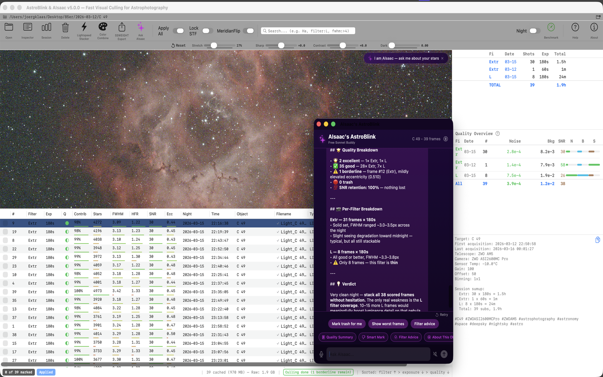
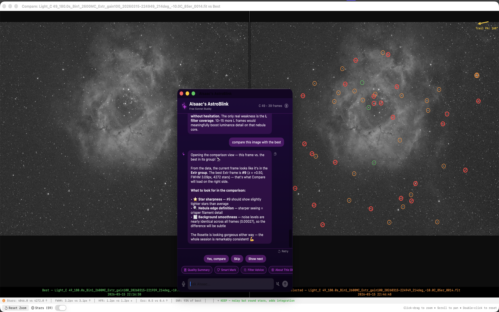
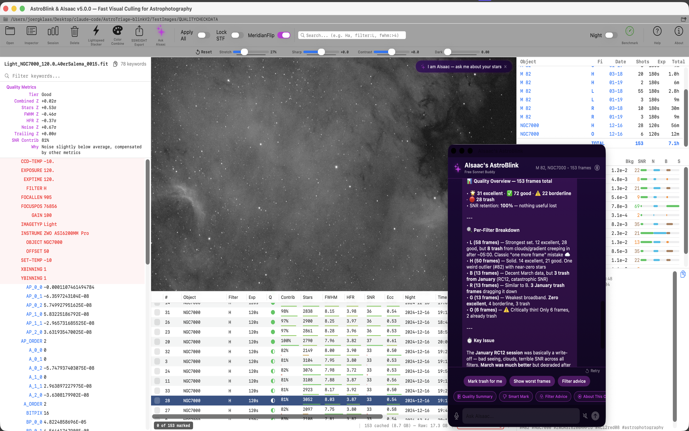
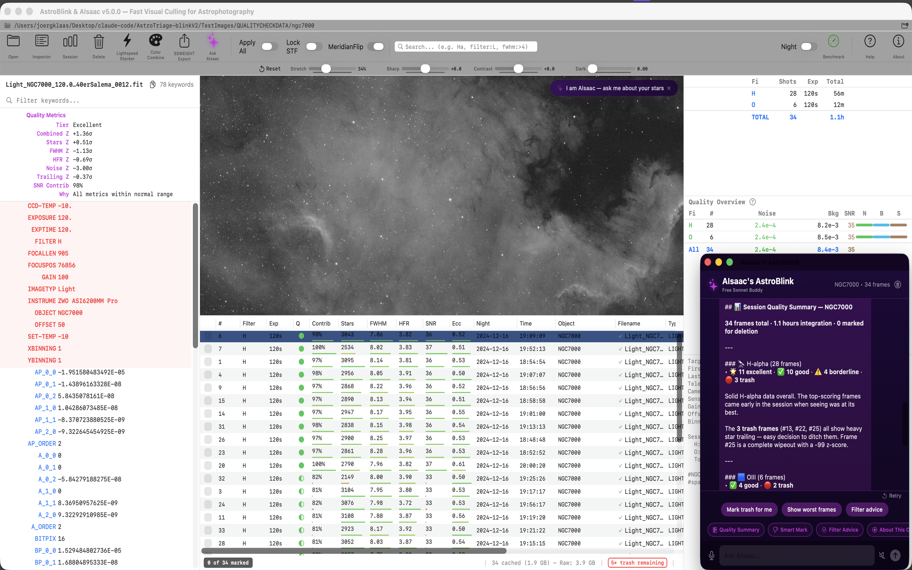
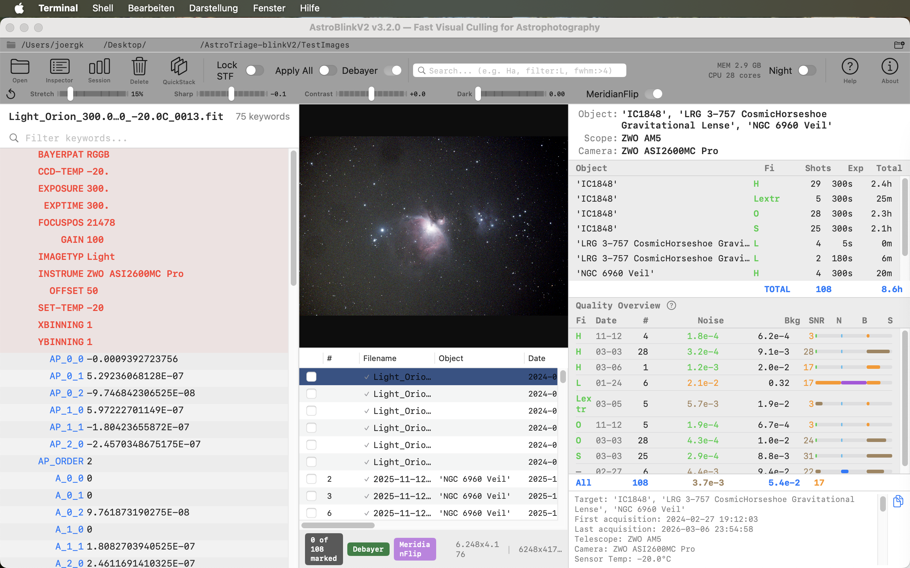
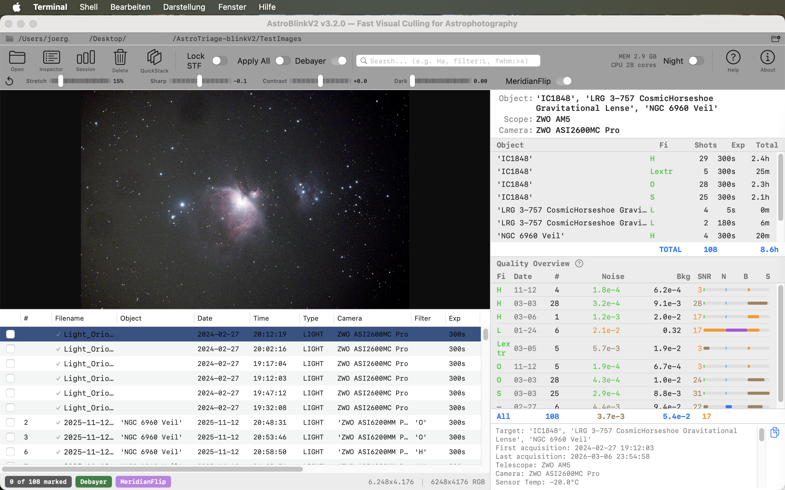
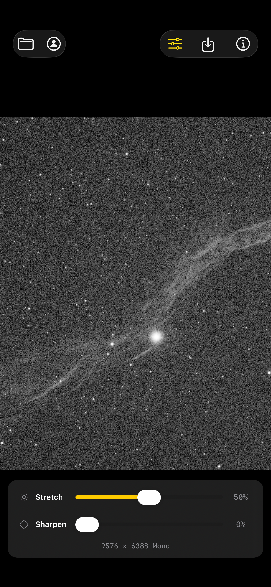
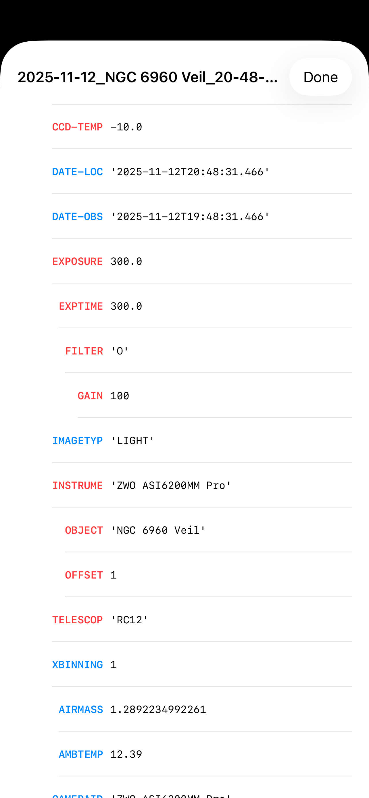

# AstroBlink & AIsaac

**Fast visual culling for astrophotography sessions on macOS — now with AI-powered session analysis.**

Blink, mark, stack — triage your astro XISF, FITS subs in seconds. GPU-stretched viewer with LightspeedStacker, QuickLook, SmartCull quality scoring, and the fastest keyboard workflow on macOS. **NEW: AIsaac, your built-in AI astrophotography assistant.**

AstroBlink lets you blink through hundreds of FITS and XISF sub-exposures in seconds, mark the bad ones, and move them out of the way — without ever permanently deleting a single file. Inspired by PixInsight's Blink, built from the ground up for Apple Silicon.

Super lightweight (~5 MB app size), yet high performance — Metal GPU compute for real-time auto-stretch, star detection, and eccentricity analysis. No Electron, no bloat. Pure native Swift + Metal, engineered for Apple Silicon with zero-copy GPU buffers and concurrent decode pipelines. Loads 500+ subs in seconds on M-series Macs.

Nice side effect: Finally you have a native XISF and FITS Quicklook for macOS. (press Spacebar shows a quick preview of the image). Was missing that for long! :-)

  

---



*Rosette Nebula in full color with AIsaac's quality breakdown — per-filter analysis, recommendations, and actionable next steps.*

---



*Side-by-side comparison with star eccentricity overlay. AIsaac explains what to look for and guides your culling decisions.*

---

## AIsaac — Your AI Astrophotography Assistant

Named after **Isaac Newton** — astronomer, physicist, and the father of reflecting telescopes. Newton didn't just observe the stars, he built the tools to understand them. AIsaac carries that spirit: an AI that doesn't just look at your data, but understands it, explains it, and helps you make better decisions.

AIsaac knows your equipment, remembers your imaging history, understands light pollution at your location, and speaks your language. He's a knowledgeable friend who happens to know everything about astrophotography — with a sense of humor.

**We'd love to hear from you!** AIsaac is brand new and we're actively improving him based on real-world feedback. If you try it, let us know what works, what doesn't, and what you'd like to see next:
- [GitHub Issues](https://github.com/joergs-git/AstroBlinkV2/issues)
- [AstroBin](https://app.astrobin.com/u/joergsflow#gallery)

---

## Highlights

- **AIsaac AI Assistant** — built-in astrophotography AI powered by Claude. Quality summaries, smart culling suggestions, filter advice, imaging plans, voice input, equipment memory. Free Sonnet tier included; bring your own API key for Opus.
- **SmartCull Quality Engine** — 5-stage pipeline (garbage detection → session sanity → z-score ranking → rescue rules → FWHM sanity) auto-classifies ~99% of frames. Cross-group P10/P90 comparison catches uniformly bad nights. Filter-aware twilight detection. Orientation consensus trailing detection (industry first). Self-calibrating per-setup quality baseline.
- **LightspeedStacker** — GPU warp+accumulate stacking, 10-20x faster than CPU. Hash-based triangle matching, Lanczos-3 interpolation, min/max pixel rejection. Color Combine for mono filter palettes (SHO, HOO, LRGB).
- **GPU Post-Processing** — real-time stretch, sharpening, contrast, dark level, color saturation, bilateral denoise, Richardson-Lucy deconvolution, gradient removal, Wiener deconvolution, structure enhancement.
- **Metal GPU Rendering** — PixInsight-compatible STF auto-stretch, zero-copy Apple Silicon buffers, <32ms navigation on cache hit.
- **Compare with Best (C key)** — side-by-side synchronized zoom/pan with star eccentricity overlay and PA direction arrows.
- **Culling Autopilot** — one-click auto-marking (Conservative/Balanced/Aggressive) with integration impact preview. Convergence guard warns when quality spread is too tight for further culling. Session Spread stats show per-metric distribution.
- **Blink Playback** — play/stop button with adjustable delay (0.1–2s) cycles through visible images endlessly. Respects filters and hide-marked. ESC to stop.
- **SSWEIGHT Export** — writes PixInsight-compatible weight keywords into FITS/XISF headers for WBPP.
- **Native FITS/XISF QuickLook** — Finder thumbnails and spacebar previews with debayer support for color cameras.
- **Bortle Sky Quality (VIIRS 2024)** — real satellite-measured light pollution for every frame. Fractional Bortle (e.g. B4.8) from NOAA VIIRS 2024 annual composite via Supabase lookup. Computed from SITELAT/SITELONG FITS headers. Offline fallback via embedded Falchi 2015 atlas.
- **Frame History Database** — persistent SQLite tracking all per-frame quality metrics across sessions. Cross-session scoring, global frame IDs, iCloud backup, archive NAS scanning.
- **In-App Messaging** — server-driven announcements, feedback collection, email signup without app updates. Rich actions, user targeting, feature unlocking.
- **iCloud Settings Sync** — all preferences and calibration data sync across Macs.

For the full version-by-version changelog, see [CHANGELOG.md](CHANGELOG.md).

---

## Performance

**Up to 5x faster session loading on local SSD. Up to 8x faster on network volumes (NAS/10GbE).**

AstroBlinkV2 was rewritten for full hardware utilization on Apple Silicon. On a Mac Studio M3 Ultra with 300 FITS files (~100 MB each), total session load time dropped from minutes to under 45 seconds.

| What changed | Before | After | Gain |
|---|---|---|---|
| FITS decode | 1 file at a time | Up to 6 concurrent | **4x throughput** |
| Memory per decode | 116 MB copy | Zero-copy GPU buffer | **-116 MB/image** |
| Downsampling (50 MP) | 30–150 ms (CPU) | < 1 ms (GPU) | **100x faster** |
| Header reading (300 files) | ~9 s | ~1.5 s | **6x faster** |
| STF statistics | ~50 ms | ~17 ms | **3x faster** |
| Prefetch pattern | Batch 4, wait all | Sliding window | **50% less stall** |
| NAS file transfer | Single stream | 4 parallel streams | **3–4x faster** |

**End-to-end (300 files, local SSD):**

| Phase | v0.9.7 | v2.0.0+ |
|---|---|---|
| Header reading | ~9 s | ~1.5 s |
| First image display | ~250 ms | ~170 ms |
| Full session prefetch | Minutes | ~30–45 s |
| Navigation (warm cache) | < 32 ms | < 32 ms |

---

## Why AstroBlinkV2?

After a night of imaging you might have 200-600 sub-exposures. Some have clouds, tracking errors, satellite trails, or planes. You need to find and remove them before stacking. AstroBlinkV2 makes this fast:

1. **Open your session folder** (Cmd+O) — images load instantly with metadata parsed from filenames and headers
2. **Blink through frames** — arrow keys with key repeat let you scan frames like a flip-book
3. **Mark the bad ones** — hit Space on anything that looks wrong (clouds, trails, blur)
4. **Hide and skip** — press H to hide marked frames from the list, K to skip them during navigation
5. **Pre-delete** — Cmd+Backspace moves all marked files to a `PRE-DELETE` subfolder — nothing is ever permanently deleted
6. **Undo if needed** — full undo stack lets you restore any pre-delete operation (Cmd+Z)
7. **Review your session** — Session Overview shows per-filter integration times and generates a shareable Fact Sheet
8. **Stack** — select your best subs and hit LightspeedStacker for an instant stacked preview

---

## Complete Feature List

### Image Viewing & Rendering
- Metal GPU rendering — 50-megapixel images display in milliseconds on Apple Silicon
- Auto STF stretch — PixInsight-compatible Screen Transfer Function makes raw linear data visible
- Lock STF (S key) — freeze exact c0/mb stretch params from current image for brightness comparison
- Apply All — bake current stretch + post-processing into all cached previews for instant navigation
- Adjustable stretch strength — slider from 0% (linear) to 100% (maximum stretch)
- GPU post-processing — real-time sharpening (unsharp mask), contrast (S-curve), and dark level sliders
- Doubled slider ranges — Stretch 0–100%, Sharpening -4/+4, Contrast -2/+2, Dark Level 0–1.0
- Zoom & pan — click-drag zoom (Photoshop-style), trackpad pinch, +/- keys, scroll to pan
- Double-click to reset zoom to fit-to-view
- Persistent settings — all sliders, toggles, and column layout remembered across sessions

### LightspeedStacker — GPU Stacking
- **LightspeedStacker** — GPU warp kernel, hash-based triangle matching, parallel star detection, full-res centroid refinement, two-pass least-squares alignment. ~15s for 16 frames.
- Select 3+ images and stack with one click — no plate solving required
- Triangle pattern matching for scale-invariant star alignment
- Affine transform alignment (rotation + translation + scale)
- Min/max pixel rejection — automatically removes satellite trails and hot pixels
- Lanczos-3 interpolation — optional sharper kernel for large dithers
- GPU bin2x pre-processing for ~4x faster stacking
- Live blue star crosses showing detected stars during processing
- Full result window with Photoshop-style zoom and all adjustment sliders
- GPU Metal compute kernel for instant slider response in result window
- Save as PNG with smart filename (object_date_filters_camera.png)
- Same-target validation — warns if you accidentally select images of different objects
- Color Combine — mono filter stacks to RGB (SHO, HOO, HSO, LRGB, HaRGB, Custom presets)

### OSC Debayer
- Automatic Bayer pattern detection (RGGB, GRBG, GBRG, BGGR) from FITS/XISF headers
- Toggle on/off (D key) — debayer OFF (default) for fastest caching, ON for color preview
- GPU-accelerated bilinear interpolation Metal compute kernel
- Debayer indicator only visible when session contains OSC images

### Night Mode
- Red-on-black UI — preserves dark-adapted vision at the telescope
- Press N — toggle night mode on/off, affects all UI elements including file list, status bar, and overlays

### Search & Filter
- Spotlight-style search — real-time filtering in the toolbar, reduces file list as you type
- Plain text search — searches across all columns (filename, object, filter, camera, etc.)
- Column syntax — `filter:Ha`, `file:Veil`, `type:LIGHT`, `fwhm:>4`, `stars:<500`, `exp:300`
- Quality filter presets — `q:trash`, `q:excellent`, `q:borderline`, `trail:>0.5`
- Column aliases — short forms like `fil`, `obj`, `cam` work as column prefixes
- Numeric operators — `>`, `<`, `>=`, `<=`, `=` for FWHM, HFR, stars, exp, gain, etc.
- Mark/Unmark filtered — batch checkmark all search results, then move or delete

### Blink Workflow & File Operations
- Space — mark/unmark images for pre-deletion (single or multi-select)
- K — skip over already-marked images during navigation
- H — cycle view: all files → hide marked → show only marked → all
- Cmd+Backspace — move all marked files to a `PRE-DELETE` subfolder (never permanent deletion)
- Cmd+M — move checkmarked files to any folder (with "Create New Folder" dialog)
- Full undo stack — Cmd+Z undoes both PRE-DELETE and Cmd+M moves, unlimited depth
- Multi-select — Shift/Cmd+click in the file list, then Space to mark all selected at once
- Arrow keys stop at boundaries (no wrap-around)
- Page Up/Home and Page Down/End for jump to first/last image

### Computed Star Metrics (HFR & FWHM)
- **GPU-accelerated star detection** — during session loading, every frame is analyzed for stars using a Metal compute kernel on the GPU (~3-5ms per image)
- **HFR & FWHM measurement** — Half-Flux Radius and Full Width at Half Maximum are computed via Gaussian fitting for the brightest unsaturated stars in each frame
- **Automatic quality scoring** — computed metrics feed into the SmartCull quality engine for multi-stage frame ranking
- **Works without NINA** — even if your capture software doesn't provide HFR/FWHM, AstroBlinkV2 computes them from the actual image data
- **Per-group source consistency** — when mixing images with and without capture-software HFR, quality scoring uses a single consistent measurement method per group to ensure fair comparison

### SmartCull Quality Engine
- **4-stage quality pipeline** — garbage detection, z-score ranking, pattern-based rescue rules, and sanity checks. Handles ~99% of quality decisions automatically
- **Orientation consensus trailing detection** — industry first: detects tracking errors by analyzing whether star elongation directions agree (tracking error) or are random (optical aberration)
- **Filter-aware trailing penalties** — narrowband (Ha/OIII/SII) gets 0.3× trailing weight (slight trailing barely affects emission nebulae), RGB 0.6×, luminance 1.0× (full strictness for the sharpness channel)
- **Focal-length-adaptive thresholds** — automatically adjusts eccentricity tolerance based on FOCALLEN from headers (short FL = more tolerance)
- **Stage 3 rescue rules** — frames with good FWHM + acceptable noise rescued from trash; star count dips recognized as transient events
- **Quality reasoning ("Why?")** — hover any quality icon for a human-readable explanation of the scoring decision
- **Culling Autopilot** — one-click auto-marking with Conservative/Balanced/Aggressive modes, each showing impact before applying
- **Per-setup self-calibration** — learns your equipment's quality baseline over time; after 30+ frames, calibrated frames are locked as KEEP
- **SSWEIGHT export** — writes PixInsight-compatible weight keyword (0-100) into FITS/XISF headers for WBPP weighted integration

### Metadata & Session Overview
- NINA filename parsing — automatically extracts target, filter, exposure, gain, temperature, HFR, star count, and more
- FITS/XISF header reading — pulls metadata directly from file headers (filter, exposure, camera, telescope, mount, coordinates, pier side, etc.)
- Header Inspector (I key) — floating window with all FITS/XISF keywords, search filtering, highlighted important keywords, scroll position preserved, multi-row selection with Cmd+C copy and "Copy All" button
- Session Overview — per-object/filter/exposure breakdown with total integration time
- Quality Overview — per-filter noise, background, and SNR statistics with color-coded bars
- Interactive quality help — click ? for beginner-friendly explanation with real-world examples and rules of thumb
- Fact Sheet generator — one click copies a ready-to-paste summary with hashtags for Astrobin, Instagram, or forums
- Auto Meridian Flip — automatically rotates images across pier side changes for consistent orientation. Supports both PIERSIDE header and ROTATOR angle fallback (for mounts like ASIAIR on AM5 that don't write PIERSIDE)
- Astronomical observing night — sessions spanning midnight are treated as one night. Quality scoring and grouping use the evening date, not the calendar date

### File List & Sorting
- 20+ sortable columns — click any column header to sort, drag to reorder
- Columns include: #, Filter, Q (quality), SNR, FWHM, HFR, Night (observing night), Time, Object, Filename, Type, Camera, Exposure, Temps, Gain, Size, Stars, Subfolder, and more
- Quality tooltips — hover over Q column for score explanations or why a score is missing
- Right-click context menu — copy filename, file path, or full path
- Smart folder scanning — opens root images only when present, scans subfolders when root is empty, automatically excludes calibration frames (DARK/FLAT/BIAS)
- Individual file selection — select specific files instead of entire folders
- File size column with human-readable formatting (MB/GB)

### Format Support

| Format | Compression | Library |
|--------|-------------|---------|
| XISF | Uncompressed, LZ4, LZ4HC, zlib, zstd, ByteShuffle | libxisf |
| FITS | Uncompressed, fpack (Rice, GZIP) | cfitsio |

### Network Volumes
- Images from NAS/SMB shares are automatically cached locally for fast browsing
- Stop/continue caching at any time with inline controls
- 4 parallel network streams for maximum throughput
- Cache is cleaned up automatically on quit

### QuickLook Extensions
- Thumbnail provider — FITS/XISF thumbnails in Finder
- Preview provider — full-size FITS/XISF preview in QuickLook (press Space in Finder)
- OSC debayer support — color camera previews show debayered color

---

## Screenshots

### macOS — AstroBlink & AIsaac

**Color Image with AI Quality Analysis:**


**Compare View with Star Eccentricity Overlay:**


**Quality Summary with AIsaac Chat:**


**Header Inspector with Quality Metrics:**


### Classic Views

**Session Overview with Header Inspector:**


**Night Mode — red-on-black for dark-adapted vision:**


### iOS — AstroFileViewer

| M42 Orion (OSC color, debayered) | NGC 6960 Veil (mono) | FITS/XISF Headers |
|:---:|:---:|:---:|
|  |  |  |

**iPad — M42 Orion Nebula with Stretch & Debayer controls:**


---

## Keyboard Shortcuts

| Key | Action |
|-----|--------|
| `←` `→` | Previous / next image |
| `Page Up/Home` | Jump to first image |
| `Page Down/End` | Jump to last image |
| `+` `-` | Zoom in / out |
| `Space` | Toggle pre-delete mark (single or multi-select) |
| `Cmd+Backspace` | Move marked files to PRE-DELETE folder |
| `Cmd+M` | Move marked files to a chosen folder |
| `Cmd+Z` | Undo last move operation |
| `S` | Toggle Lock STF (freeze stretch params) |
| `K` | Toggle skip-marked during navigation |
| `H` | Cycle view: all → hide marked → only marked → all |
| `I` | Toggle FITS/XISF header inspector |
| `D` | Toggle OSC debayer (when Bayer images detected) |
| `N` | Toggle night mode (red-on-black) |
| `C` | Compare with best frame |
| `U` | Unmark all |
| `Cmd+O` | Open folder or select files |
| `Double-click` | Reset zoom to fit-to-view |

---

## AstroFileViewer — iOS Companion App

**AstroFileViewer** is a companion iOS/iPadOS app for viewing FITS and XISF astrophotography files on your iPhone or iPad.

<!-- TODO: Add App Store badge/link when available -->
<!-- [](https://apps.apple.com/app/astrofileviewer/idXXXXXXXXXX) -->

### Features

- **Open FITS and XISF files** directly from the Files app, iCloud Drive, or any document provider
- **Auto STF stretch** — same PixInsight-compatible algorithm as the macOS app
- **Adjustable stretch strength** — slider from 0% (fully linear) to 100%
- **Dark point slider** — raises the black point to clip faint background noise (same as macOS AstroBlink)
- **GPU bilateral denoise** — edge-preserving noise reduction that smooths background while keeping stars sharp
- **Auto gradient correction** — adjustable removal of linear light pollution gradients (0–300%)
- **File history & swipe navigation** — cached files with swipe left/right to navigate between recently viewed images
- **Auto-rotate** — landscape images automatically rotated to fill the screen in portrait mode
- **OSC debayer** — automatic Bayer pattern detection with GPU-accelerated bilinear interpolation
- **Sharpening** — real-time unsharp mask with adjustable strength
- **FITS/XISF header viewer** — browse all metadata keywords with priority sorting
- **Save to Photos** — export stretched images as JPEG to your Photo Library
- **Persistent settings** — slider positions and gradient toggle saved across launches
- **Universal app** — optimized for both iPhone and iPad
- **Automatic bin2 display** — large sensor images (e.g. ZWO ASI6200MM at 9576×6388) are automatically downscaled for smooth display

### iOS Screenshots

| iPhone — M42 | iPhone — Veil | iPad — M42 |
|:---:|:---:|:---:|
|  |  |  |

The iOS app source code is included in this repository under [`AstroFileViewer-iOS/`](AstroFileViewer-iOS/).

---

## Requirements

### macOS (AstroBlinkV2)
- **macOS 13 Ventura** or later
- **Apple Silicon** required (M1/M2/M3/M4) — engineered for unified memory architecture
- Metal-capable GPU

### iOS (AstroFileViewer)
- **iOS 16.4** or later
- iPhone or iPad with Metal support

---

## Installation

### Download Release (macOS)

1. Download the latest release from the [Releases](https://github.com/joergs-git/AstroBlinkV2/releases) page
2. Unzip and drag `AstroBlinkV2.app` to your **Applications** folder
3. Double-click to launch — the app is signed and notarized by Apple

### AstroFileViewer (iOS)

Download AstroFileViewer from the Apple App Store (link coming soon).

### Build from Source

1. Clone the repository:
   ```bash
   git clone https://github.com/joergs-git/AstroBlinkV2.git
   cd AstroBlinkV2
   ```

2. **macOS app:** Open `AstroTriage.xcodeproj` in Xcode 15+ and build (Cmd+R)

3. **iOS app:** Open `AstroFileViewer-iOS/AstroFileViewer.xcodeproj` in Xcode 15+ and build for your device

The project includes vendored C/C++ libraries (libxisf, cfitsio) as a local Swift Package — no external dependencies to install.

---

## How It Works

AstroBlinkV2 decodes FITS and XISF files using cfitsio and libxisf through a C bridge, renders them on the GPU via Metal compute shaders with a PixInsight-compatible STF auto-stretch, and displays them in an MTKView. Navigation is keyboard-first with full key repeat support. Metadata is extracted from both filenames (NINA token patterns) and file headers, merged with header values taking priority.

The workflow is non-destructive by design: marking a file only sets a flag in memory, and the "pre-delete" action physically moves files to a dedicated subfolder — never to Trash, never permanently deleted. A full undo stack allows you to reverse any pre-delete operation.

LightspeedStacker uses triangle pattern matching on the brightest stars in each frame, computes affine transforms for alignment, and mean-combines aligned frames — all without external plate solving. The warp+accumulate step runs on the GPU via a Metal compute kernel with hash-based triangle lookup for near-instant matching.

Floating windows (Session Overview, Header Inspector, Quick Stack Result) stay above the main AstroBlinkV2 window while working but go behind other apps when you switch away.

---

## Supported NINA Filename Tokens

AstroBlinkV2 parses the standard NINA filename pattern:

```
2026-03-06_IC1848_23-54-58_RASA_ZWO ASI6200MM Pro_LIGHT_H_300.00s_#0016__bin1x1_gain100_O50_T-10.00c__FWHM_4.15_FOCT_4.46.xisf
```

Extracted tokens: date, target, time, telescope, camera, frame type, filter, exposure, frame number, binning, gain, offset, sensor temp, FWHM, focuser temp, HFR, star count.

---

## FAQ

### Why is LightspeedStacker so fast — and is it accurate?

LightspeedStacker achieves 10-20x speedup over CPU stacking while maintaining near-identical alignment quality:

1. **GPU warp+accumulate** — The biggest bottleneck in stacking is warping each frame to match the reference. LightspeedStacker offloads this to a Metal compute kernel that runs thousands of GPU threads in parallel.

2. **Parallel star detection + full-res centroid refinement** — All frames are analyzed simultaneously via Swift TaskGroup. After coarse detection on subsampled data, each star position is refined using a 9×9 weighted centroid on the full binned-resolution image — the same approach used by professional astrometry tools (SExtractor, DAOPHOT).

3. **Hash-based triangle matching** — Quantizes triangle shape ratios into hash buckets for O(1) lookups — same 455 triangles from 50 stars, but matched ~100x faster than brute-force O(N²).

4. **Two-pass least-squares refinement** — The initial 3-point affine from triangle matching is refined using ALL inlier star correspondences (typically 20-40 pairs) via least-squares normal equations. A second pass with a tighter threshold (4px) converges to sub-pixel alignment accuracy.

5. **GPU restretch** — The result window sliders use a Metal compute kernel (`restretch_float`) for instant response (<16ms) instead of CPU processing.

### Why don't the computed HFR/FWHM values match what NINA reports?

Different software measures HFR/FWHM differently. NINA measures during capture (often on a subframe), while AstroBlinkV2 measures post-capture on the full saved frame with its own star detection algorithm. The absolute numbers will differ, but the *relative ranking* (which frames are better/worse) should be very consistent. AstroBlinkV2's quality scoring always uses the same measurement method across all frames in a group to ensure fair comparison.

### Is the quality scoring scientifically accurate?

The quality scoring is designed for *triage* — quickly identifying the best and worst frames for stacking decisions. It uses robust statistical methods (median HFR, FWHM, noise estimation, z-scores within groups) but is not intended to replace scientific photometry tools like PixInsight or AstroImageJ. Think of it as a fast, automated version of the visual blinking you'd do in PixInsight's Blink tool, enhanced with quantitative metrics.

### Is this scientific stacking?

No. LightspeedStacker is designed for **visual preview only** — a quick "what does my data look like stacked?" without leaving the triage app. It is not a replacement for dedicated stacking software like PixInsight, Siril, or APP. Specifically:

- **No astrometric calibration** — alignment uses triangle pattern matching, not plate solving with a star catalog
- **No calibration frames** — no dark, flat, or bias subtraction
- **Min/max rejection only** — removes single-frame outliers (satellite trails, hot pixels) but no sigma clipping or advanced rejection

LightspeedStacker does support optional Lanczos-3 interpolation and min/max pixel rejection. The stacked result is meant to give you a quick visual impression of your session's potential — not a final image.

---

## Author

**joergsflow**

- [Astrobin Gallery](https://app.astrobin.com/u/joergsflow#gallery)
- [Instagram](https://www.instagram.com/joergsflow/)
- [GitHub](https://github.com/joergsflow)
- joergsflow@gmail.com
- [AstroBlink Homepage](https://astroblink-aisaac.joergsflow.workers.dev)

---

## License

This project is licensed under the **GPLv3 License** — see [LICENSE](LICENSE) for details.

libxisf is licensed under GPLv3. cfitsio is licensed under the NASA Open Source Agreement.

---

*Clear skies and happy imaging!*
